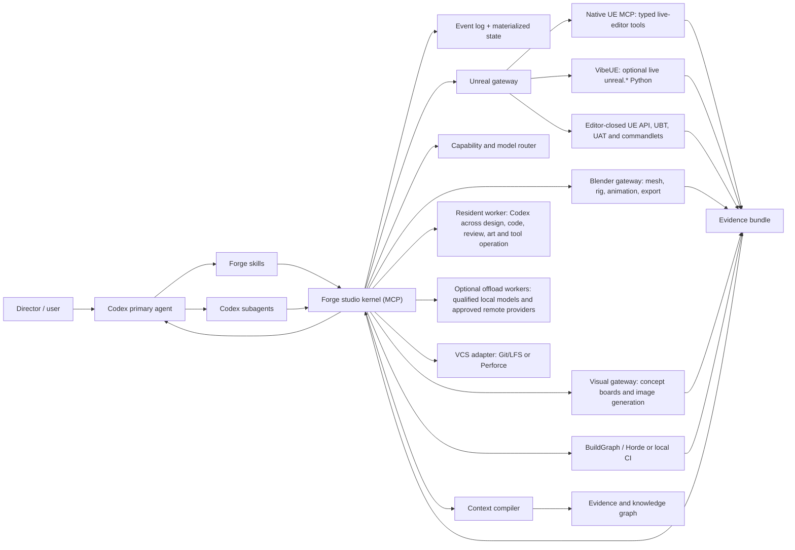

# Forge: a Codex-native, GSD-compatible Unreal studio

Status: counter-plan for design review
Date: 2026-08-14
Target: Unreal Engine 5.8, from project inception through release and live operation

## Executive verdict

Claude's plan is unusually strong on context discipline, evidence, Unreal's single-editor constraint, verifier quality, and learn-once behavior. Its main weakness is architectural: it proposes a renamed hard fork of GSD before proving that a fork is necessary, even though current GSD already supports Codex and current Codex has native plugins, skills, project-scoped agent definitions, MCP, hooks, and subagents.

Forge keeps the parts of Claude's plan that are genuinely good, but changes the product boundary:

> GSD remains the upstream phase engine. Codex is the host. Forge is an installable Codex plugin backed by a deterministic studio kernel and an Unreal gateway.

That choice makes the first useful release smaller, reduces rebase work, keeps upstream fixes, and gives the framework a reliable place for state, leases, resumability, context compilation, model routing, and audit trails. A fork remains an escape hatch only if a written extension-gap test proves an upstream seam is missing.

The Unreal gateway deliberately separates native MCP, optional VibeUE live Python, and editor-closed Unreal API/commandlet work. Forge also treats visual development, Blender and Unreal asset/rig/animation authoring, and Unreal art integration as a complete parallel production stream. Because Forge runs inside Codex, Codex is the resident default worker and supervisor across design, code, review, visual generation and DCC/Unreal tool operation. Local and remote models are optional capability-based workers registered through provider-neutral contracts. Forge offloads bounded work only when a candidate proves the required quality and lowers effective context, time, cost or lane pressure.

The fastest proof is not a renamed command set. It is this closed loop:

`idea -> scoped GDD decision -> work DAG -> Codex agent -> Unreal mutation -> compile/test/PIE -> cook -> evidence bundle -> resumable state`

The framework is not accepted until that loop works from a sterile machine profile and survives an editor crash.

## What the competing plan gets right

Keep these mechanisms, with their semantics intact:

1. Resource lanes, especially exclusive `editor-mcp`, mutually exclusive `editor-closed`, `editor-human`, and parallel free/read-only work.
2. Referral-style context loading rather than sending whole manuals or the full GDD.
3. A cold-start contract: an agent knows only its task packet and named sources.
4. Evidence layers that distinguish filesystem, structural editor state, runtime, end-to-end, regression, human feel, and packaged-release proof.
5. The rule that a verifier must pass known-good and known-bad controls before its verdict affects routing or promotion.
6. Substitution before demotion so a repeatable brief defect is not misclassified as a model defect.
7. Stale knowledge decaying to `unknown`, with history preserved.
8. Single writer for binary assets, maps, editor state, and shared ownership units.
9. Playable phase boundaries and a human-only feel gate.
10. Research proposals that are quarantined, reversible, confidence-labelled, and prevented from editing authoritative knowledge directly.
11. Thin Unreal craft guidance backed by citations and mechanical checks where possible.
12. A walking skeleton before staffing, broad knowledge ingestion, or speculative departmental breadth.

These are not differentiators to discard. They are the baseline Forge must preserve.

## Why Forge is a better base

### 1. Adapt upstream; do not begin with a hard fork

The supplied plan pins its observations to GSD 1.9.1 and spends substantial effort pruning, renaming, repairing identity assumptions, and maintaining a fork. The current upstream repository's `next` branch reports version 1.10.0 and describes Codex as a supported runtime. Forge therefore starts with a compatibility matrix against a pinned upstream commit.

Decision rule:

- If a need can be implemented as a Codex plugin, skill, agent configuration, MCP tool, hook, GSD capability, or additive workflow, do that.
- If upstream lacks a required extension seam, first propose the seam upstream.
- Fork only the smallest package that cannot be extended, and keep an automated semantic-diff/rebase test.

This replaces a permanent fork cost with an evidence-triggered fork option.

### 2. Models propose; a deterministic kernel owns truth

No model, including the supervising model, owns work state. The kernel owns:

- project and environment snapshots;
- work-order state and dependency edges;
- resource leases and heartbeats;
- attempts, idempotency keys, timeouts, and retries;
- context manifests and freshness hashes;
- evidence, approvals, and release gates;
- model/tool profiles and their measured results;
- append-only events and materialized views.

Models may propose transitions. The kernel validates and commits them. This prevents a compacted chat, failed agent, or hallucinated status from becoming studio truth.

### 3. Codex-native packaging controls context

Forge uses each Codex surface for the job it actually fits:

| Surface | Forge responsibility |
|---|---|
| `AGENTS.md` | Short repository rules: layout, source-control policy, safety, build/test commands, definition of done |
| `.codex/config.toml` | Trusted repo defaults, agent concurrency, sandbox profiles, MCP registration, hooks |
| `.codex/agents/*.toml` | Narrow on-demand roles with explicit model/reasoning/tool/sandbox defaults |
| Skills | One user goal or repeatable workflow each; progressively disclosed, not an always-loaded canon |
| Forge plugin | Distribution unit for skills, MCP connection, hooks, schemas, and assets |
| Forge MCP server | Typed state and orchestration tools; the only mutation route into studio state |
| Unreal gateway | Typed, versioned, lease-enforced editor/commandlet operations |
| GSD | Discuss/plan/execute/verify/ship phase behavior and compatible artifacts |

Codex officially loads skills progressively and supports project-scoped custom agents. Forge uses those native mechanisms instead of emulating a second agent runtime inside prompts.

GSD is not merely a compatible artifact format. It is the only phase state machine. Forge installs its project overlay before a `.uproject` exists, bootstraps capabilities in a fresh task, and uses `$forge-next` to combine Forge readiness with GSD smart-entry. GSD's `.planning` artifacts remain authoritative at every discuss, plan, execute, verify, pause, failure, and completion boundary; Forge does not mirror the phase pointer or auto-chain across a manual boundary.

Forge workflow controls, GSD phase/plan IDs and project production packets occupy separate namespaces. Canonical project packet IDs are registered once and remain immutable. A later plan may add a provenance-bearing child or an explicit alias, but it may not silently replace `P0` with `W1` and describe that packet as a Forge step.

## Architecture



### Plugin layout

```text
forge-ue-studio/
  .codex-plugin/plugin.json
  skills/
    forge-bootstrap/SKILL.md
    forge-next/SKILL.md
    forge-init/SKILL.md
    forge-doctor/SKILL.md
    forge-discuss-game/SKILL.md
    forge-plan-milestone/SKILL.md
    forge-execute/SKILL.md
    forge-verify/SKILL.md
    forge-review/SKILL.md
    forge-research/SKILL.md
    forge-visual-development/SKILL.md
    forge-build-asset/SKILL.md
    forge-integrate-asset/SKILL.md
    forge-release/SKILL.md
    forge-recover/SKILL.md
  agents/
    director.toml
    technical-director.toml
    explorer.toml
    gameplay-engineer.toml
    content-builder.toml
    art-director.toml
    concept-artist.toml
    asset-technical-director.toml
    blender-modeler-rigger.toml
    animator.toml
    technical-artist.toml
    qa-verifier.toml
    build-release.toml
    critic.toml
  mcp/
    forge-kernel/
    unreal-gateway/
    blender-gateway/
  providers/
    codex-native/
    openai-compatible/
    local-model/
  schemas/
  hooks/
  assets/
    game-skeletons/
    work-order-templates/
    buildgraph/
    tests/
```

Roles are spawned on demand. They are not eight permanent conversations and are never assumed to be different models.

## Dependency and capability policy

The supplied `dependancies/` directory is an evidence bundle, not an install manifest. It contains craft-manual chapter maps, an Epic API scrape estimate/config/probes, and verified PowerShell harnesses for local Ollama work. It does **not** contain VibeUE, the native Unreal MCP plugin, Blender, or installers for optional model providers.

Forge classifies runtime integrations instead of declaring every useful tool a hard dependency:

| Component | Classification | What it contributes | Route when absent |
|---|---|---|---|
| Codex + Forge plugin/kernel | Core and resident default worker | Host, orchestration, design/code/review, visual generation when exposed, tool operation, state, routing and evidence | Installation cannot proceed |
| Upstream GSD | Core phase engine | Discuss/plan/execute/verify workflow | Extension-gap spike decides compatibility or smallest justified fork |
| Unreal Engine + project | Required for UE execution | Editor, commandlets, C++/Python APIs, build/cook/test | Planning, research and non-UE asset work may continue |
| Native Unreal MCP | Recommended | Typed discovery, live-editor inspection/mutation, PIE and viewport evidence | Use editor-closed API where supported; queue live-only work or route it to a human |
| Unreal Python Editor Script + Editor Scripting Utilities | Recommended engine plugins | The broad `unreal.*` automation surface in editor or commandlet processes | Use typed MCP/C++/UAT routes; mark unsupported operations unavailable |
| VibeUE | Optional recommended accelerator | Adds live `execute_python_code`, arbitrary `unreal.*`, skills and service wrappers to the merged MCP surface | Native MCP for typed work plus editor-closed Unreal Python commandlets for broad/offline work |
| Blender + Blender gateway/MCP | Optional until bespoke art is scheduled | Independent DCC lane for mesh, UV, material, rig, animation and export production | Use capable Unreal authoring routes, Fab/approved library assets or graybox primitives |
| Codex image generation and tool access | Resident visual/tool route when exposed | Art and photo concepts, boards, callouts, variations, image editing, Blender/Unreal operation, code and review | Use licensed references, existing assets or another verified route when a required tool is unavailable |
| Ollama/LM Studio/llama.cpp and other local models | Optional offload tier | Low-cost long-context extraction, classification, bounded drafting, code/review, visual breakdown and tool operation after task-specific qualification | Resident Codex worker or another approved occupant |
| Skill Seekers | Optional research intake | Documentation/API ingestion experiments | Direct local source/API inspection and bounded manual research |
| Git/LFS or Perforce | Required before durable production writes | Revision, ownership, locking, rollback and review | Read-only work only until a VCS adapter passes |
| BuildGraph/Horde, shared DDC and platform SDKs | Milestone capabilities | Team scale, reproducible builds and platform release | Local build routes until their milestone makes them blocking |

VibeUE is therefore **not a Forge prerequisite**. It earns installation when its capability probe shows live Python or its service wrappers close a real route gap. It remains valuable because native MCP alone does not expose arbitrary `unreal.*` execution. It is not allowed to become the only path to an operation that can be performed more reliably by an editor-closed commandlet.

### Capability-to-workflow closure mechanism

The first-time installer and the standing Research department use the same absorption kernel. The installer bootstraps that kernel before attempting optional integrations, then invokes it for every detected or approved MCP, CLI, API, DCC and model provider.

Each integration produces a versioned capability contract:

```yaml
capability: ue.python.commandlet
provider: unreal-5.8-python-editor-script
status: AVAILABLE_VERIFIED
mode: editor-closed
lane: ue-project-exclusive
health_probe: probes/ue-python-commandlet-v1.json
schema_or_catalog_hash: "..."
enables: [batch-import, ik-retarget, asset-audit, lod-generation, heavy-nullrhi-edit]
constraints: [project-editor-must-be-closed, result-file-is-authority]
fallbacks: [ue.native-mcp, editor-human]
acceptance_suites: [CAP-UEPY-01, CAP-UEPY-02]
expires_on: [engine-version, plugin-set, script-hash]
```

The kernel maintains one **Capability-to-Acceptance Closure Matrix**:

`capability -> provider -> lane -> enabled workflow steps -> fallback -> probe -> acceptance suite`

No recipe may name a tool directly. It requests capabilities. The workflow compiler selects a verified route, removes optional steps whose capability is absent, substitutes a declared fallback, or marks only the affected step blocked. This is the mechanism that connects weakly linked engine constraints and acceptance tests back into executable work.

The stable Forge directives define safety, evidence, state and routing semantics. Generated capability overlays contain machine-specific paths, tools, models and limits. Codex is the declared resident default because it is already the Forge host, while every offload preference is computed. Free/local and already-installed routes receive a cost/locality advantage only after they pass the task's quality and safety floor. The route scorer may delegate bounded context-heavy work to local workers, or alternate Blender and Unreal authoring for the same asset class, when benchmarks, queue pressure or hardware contention justify it.

## The studio kernel

### State model

Use an append-only event store with a rebuildable materialized view. SQLite with WAL is the default local implementation; JSON export remains the portable interchange format.

Core records:

- `Project`: identity, engine association, source-control adapter, target platforms.
- `EnvironmentSnapshot`: detected tools, versions, hashes, capacity, expiry.
- `GameDecision`: atomic design ruling, alternatives, owner, affected requirements.
- `Requirement`: pillar/feature/non-functional requirement with trace links.
- `Milestone`: lifecycle gate and measurable exit criteria.
- `WorkOrder`: one outcome, exact ownership units, typed dependencies, acceptance profile.
- `Attempt`: immutable dispatch, context hash, occupant, budget, result.
- `Lease`: resource, holder, PID/session, heartbeat, TTL, recovery action.
- `Artifact`: source/binary/generated asset, provenance, licence, revision, owner.
- `Evidence`: claim, method, layer, environment, revision, result, residue.
- `Finding`: severity, scope, owner, resolution or accepted risk.
- `CapabilityProfile`: tool/model abilities established by probes or evals.
- `KnowledgeProposal`: source, confidence, blast radius, quarantine and rollback.

Every mutation carries:

- an idempotency key;
- expected prior revision;
- actor and owning work order;
- input and output hashes;
- result or compensating action;
- timestamp and environment snapshot ID.

### Work-order state machine

```text
PROPOSED -> READY -> LEASED -> DISPATCHED -> RUNNING
RUNNING  -> VERIFYING -> REVIEWING -> DONE
RUNNING  -> BLOCKED | FAILED_RETRYABLE | FAILED_FINAL | ABANDONED
any active state -> STALE -> SUPERSEDED
```

Transitions are schema-validated. `DONE` is impossible while required evidence, review, documentation impact, open handoffs, or dependent invalidation remains unresolved.

### Scheduler

The scheduler is constraint-first, not prompt-first:

1. Finish or unblock in-flight work before starting new work.
2. Reject tasks whose hard prerequisites are absent.
3. Acquire all declared resources atomically in stable order.
4. Prefer headless/editor-free work when the editor lane is occupied.
5. Parallelize only disjoint write sets with no unresolved artifact/interface edge.
6. Keep art, engineering, design, audio and research lanes working concurrently once their approved contracts exist; do not serialize departments merely because one provider can do several jobs.
7. Start with Codex as the resident occupant. Offload a decomposed task to an available free/local worker when it passes the task-specific standard and reduces token, elapsed-time or lane cost; keep complex, ambiguous and cross-system integration work on Codex by default.
8. Revalidate context immediately before dispatch and again before commit.
9. On crash or timeout, inspect targets, expire the lease, and resume from the last committed transition—not from chat memory.

Initial resources:

- `ue-project:<project>` exclusive super-lock for any process that can write UE packages;
- `ue-live-native-mcp:<project>` live typed MCP mode under the project lock;
- `ue-live-python:<project>` VibeUE/live-Python mode under the same live-editor process and project lock;
- `ue-editor-closed-api:<project>` `UnrealEditor-Cmd`/Python/commandlet mode, mutually exclusive with every live-editor mode;
- `ue-editor-human:<project>` human interaction mode, mutually exclusive with agent-driven editor mutation;
- `human-visual:<project>` scarce and non-substitutable;
- `vcs-ownership:<unit>` exclusive write ownership;
- `gpu:<device>` capacity weighted by VRAM;
- `cpu-build`, `shader-compile`, `cook`, `network`, `platform-device`, `dcc:<tool>`;
- provider budgets and rate limits.

## Exactly what an agent receives

Claude's referral idea is correct but underspecified as an executable interface. Forge compiles a signed, immutable work packet.

```yaml
schema: forge.work-packet/v2
work_order: WO-0042
attempt: 2
role: gameplay-engineer
objective: "A tap triggers exactly one dodge; holding does not retrigger."
non_goals:
  - "No stamina rebalance"
  - "No animation replacement"
project_snapshot: env-2026-08-14T12:00Z-a91c
base_revision: "<VCS revision>"
isolation:
  mode: git-worktree
  workspace: "<dedicated worktree path>"
  branch: "codex/wo-0042"
read_set:
  - path: Source/Game/Combat/DodgeComponent.cpp
    sha256: "..."
    reason: implementation target
write_set:
  - Source/Game/Combat/DodgeComponent.cpp
  - Source/GameTests/DodgeSpec.cpp
ownership_units:
  - code:combat-dodge
context:
  decisions: [DEC-019]
  requirements: [REQ-COMBAT-007]
  game_map_nodes: [Combat.Dodge]
  recipes: [implement-gameplay-ability/v3]
  craft_cards: [gameplay-framework/v2, input/v1]
  hazards: [UE58-INPUT-003]
  prior_evidence: [EV-111]
tool_contract:
  allowed: [filesystem.patch, build.editor, test.automation]
  denied: [unreal.asset_mutate, network.write]
  schema_hashes: { forge: "...", unreal: "..." }
resources:
  - vcs-ownership:code:combat-dodge
acceptance:
  - claim: "one press produces one dodge"
    falsifier: "automation test sends press+hold and counts activations"
    required_layer: L4
budget:
  wall_minutes: 25
  attempts_remaining: 2
  output_tokens: 5000
stop_when:
  - acceptance proven
  - source hash changes
  - undeclared dependency discovered
return_schema: forge.attempt-result/v1
```

The packet contains pointers plus reasons, hashes, and narrow excerpts only when a source cannot be addressed directly. It never contains the entire GDD, complete project map, prior agent transcript, or builder self-assessment for an independent reviewer.

The agent returns structured data:

```yaml
status: complete|partial|blocked|failed
artifacts: []
state_delta: []
evidence: []
assumptions: []
uncertainties: []
residue: []
questions: []
recommended_followups: []
```

Conversation is presentation; this object is the handoff.

## Context compiler

Context is compiled for every attempt from authoritative state, not copied from the previous prompt.

### Layers

1. Kernel: work packet schema, safety, result schema, maximum 1–2k tokens.
2. Task: objective, non-goals, dependencies, ownership, acceptance, budgets.
3. Routed evidence: the smallest graph-connected set of decisions, code/assets, hazards, recipes, and prior evidence needed for the current step.

### Selection algorithm

1. Start at requirement, ownership unit, target path, and acceptance claim.
2. Traverse only approved relation types within a token and hop budget.
3. Rank sources by authority, freshness, directness, and reversal cost.
4. Include contradictions explicitly; never collapse them into one confident summary.
5. Emit a context manifest with hashes, source locations, confidence, and why each item was selected.
6. Validate that every recipe exit condition has supporting context.
7. If the packet does not fit, split the work order. Do not summarize away acceptance or safety.

### Context metrics

Record per attempt:

- routed tokens and percent actually cited;
- irrelevant-context rate;
- missing-context referrals;
- stale-context restarts;
- context reused via stable prefix/cache;
- evidence-to-assertion coverage;
- result quality and retry cause.

The compiler is improved only from measured failures, not from a model's opinion that more context would be helpful.

### Acceptance-suite decomposition decision

Keep one authoritative acceptance registry, but never load or execute it as one worker packet. The low graph cohesion does not mean the acceptance rules are wrong; it means installation, routing, Unreal, visual production, recovery and release checks are only loosely related at execution time.

Forge therefore groups acceptance cases into independently runnable suites:

- `core-state-and-recovery`;
- `installer-and-capability-routing`;
- `context-and-handoffs`;
- `unreal-live-mcp`;
- `unreal-live-python`;
- `unreal-editor-closed-api`;
- `visual-asset-production`;
- `build-release-and-liveops`.

A worker receives one suite, the shared test contract, and only the capability records and artifacts named by that suite. Cross-suite invariants run as small contract tests at promotion gates. Split further when a packet breaches its context budget, irrelevant-context rate exceeds 15%, or a worker needs more than one referral to locate required evidence. This follows GSD's referral/context discipline without swamping workers.

## Environment adaptation

`forge doctor` produces `EnvironmentSnapshot`, not a prose report alone.

### Discovery

- OS, CPU, RAM, disks, GPU/VRAM, driver, available concurrency.
- UE roots, exact engine version/commit, launcher vs source build, project association.
- required Visual Studio components, compiler, Windows SDK, platform SDK visibility.
- project plugins and their versions; native UE MCP, Python Editor Script, Editor Scripting Utilities and VibeUE availability.
- live native-MCP toolsets, VibeUE tools/skills, schemas, tool-catalog hashes, ports, transport, read/write probes.
- editor-closed Unreal Python API probe, locally generated API reference/stubs, engine-header index, commandlet result-file probe and `-nullrhi` suitability.
- UBT, UAT, commandlets, Automation, Functional Tests, Data Validation, Gauntlet, BuildGraph.
- Git/LFS or Perforce; merge/lock capabilities; current revision and dirty state.
- local/shared/cloud DDC, cache health, shader compiler capacity.
- resident Codex modalities and tool access; installed local model endpoints and metadata; entitled services and approved remote providers; quotas, context limits, modalities, tool access and effective cost.
- DCC tools, Blender version/add-ons/MCP/API, licences, render devices, audio/image/video generators, Codex image-generation access.
- network restrictions, sandbox permissions, writable roots, human checkpoints.
- target platforms, devices, signing/certification prerequisites—presence only, never secret values.

### Capability classification

Each capability is one of:

- `AVAILABLE_VERIFIED`: probe passed in this snapshot.
- `AVAILABLE_UNVERIFIED`: detected but not safely probed.
- `UNAVAILABLE_OPTIONAL`: route degrades.
- `UNAVAILABLE_BLOCKING`: named milestone cannot start.
- `STALE`: version/hash changed since proof.

No machine-specific absolute path enters a shipped skill or recipe. A locator resolves logical names such as `ue.editor`, `ue.run_uat`, or `vcs.lock_asset` from the current snapshot.

### Adaptation policy

- Solo Git/LFS project: use worktrees for text, LFS locks for binary ownership, local UAT, local Zen DDC.
- AAA Perforce project: use changelists/streams, exclusive asset locks, UGS conventions, shared/cloud DDC, BuildGraph/Horde.
- No live editor: perform read-only planning, code, research, and headless-safe work; queue editor mutations.
- Native MCP present, VibeUE absent: keep typed live-editor workflows and route broad, batch or heavy Python work through editor-closed commandlets; queue only truly live-Python-only tasks.
- VibeUE present: enable live-Python recipes only after its health, licence and rollback probes pass; corruption disables that route for the attempt without taking native MCP down.
- Native MCP absent: use editor-closed Unreal API/UAT routes where valid and expose remaining editor-only work as a human or blocked step rather than pretending parity.
- Unreal API/commandlet route unavailable: disable every recipe that requires it and select native MCP, C++/UAT or human fallbacks from the closure matrix.
- Low VRAM: serialize GPU jobs, prefer headless/null-RHI operations where valid, lower preview quality only—not acceptance quality.
- No local model: Codex remains the resident worker; only local offload capacity is lost.
- No cloud access: use proven local occupants within their measured envelope and stop at unsupported gates.
- No Blender: mechanics continue with graybox/Fab placeholders; route supported modelling, Control Rig, animation, procedural and material work through verified Unreal capabilities and keep unsupported asset work in a replacement-safe backlog.
- Blender and Unreal art routes both available: benchmark them by asset class, quality, elapsed time, GPU/editor-lane contention and rework rate. Prefer Blender for independent DCC work when it frees the Unreal lane; prefer Unreal when in-engine authoring, Control Rig, Sequencer, retargeting, procedural tools or reduced round-tripping wins.
- No image generator: visual development uses approved references and manually supplied boards; no workflow fabricates generated imagery.
- No optional model provider: nothing fundamental changes; Codex remains resident. Independent-provider review is marked degraded only when no genuinely independent worker exists.

## Model and tool routing

Seats are logical responsibilities. Codex is their resident default occupant and orchestration authority; other occupants are selected per attempt for measured offload, independence or specialist advantage.

### Hard constraints first

Reject an occupant lacking any required property:

- tool and filesystem access;
- required modality;
- context capacity;
- structured-output reliability;
- confidentiality/data-residency eligibility;
- language/domain minimum score;
- remaining rate, cost, or time budget;
- permission to mutate the declared target type.

### Then optimize

For an eligible offload candidate, score its advantage over the resident Codex route:

`expected_quality + locality_advantage + verified_cost_advantage + parallelism_gain - retry_risk - latency_cost - monetary_cost - queue_cost - lane_contention - handoff_cost`

Scores come from versioned evals and production evidence by task type. Already-installed, local and verified-zero-marginal-cost workers are preferred for qualified bounded work, but locality or a licensing label never proves cost and cost never bypasses the quality, security or acceptance floor. Keep ambiguous architecture, cross-domain integration, final synthesis and high-risk mutation with Codex unless another worker proves equal or better for that exact class. Provider tags or self-descriptions are discovery hints, not competence proof. Scores decay when versions, hardware, plugins or task classes change.

### Resident Codex and context-efficient local offload

Codex owns decomposition, interface decisions, final synthesis and recovery by default. Its available visual generation can create and edit concept art, photo references, boards and texture ideation. Through verified Blender and Unreal gateways, Codex can also author meshes, rigs, animation, materials and in-engine assets; the artifact is credited to the tool route, not treated as a text-model output.

Before dispatch, the context compiler asks whether a task can be isolated behind a stable input/output contract. Good local-offload candidates include long document extraction, asset-catalog passes, image-to-3D breakdown drafts, variant generation, log triage, bounded code implementation, test generation, first-pass review, repetitive Blender operations and batch asset analysis. A local model receives the smallest sufficient packet, source referrals and schema—not the whole GDD or parent conversation—and returns structured findings plus evidence. This saves resident-context usage and increases parallel throughput.

Do not offload merely because a task is long. Keep tasks on Codex when they require unresolved design judgment, broad cross-system state, novel architecture, delicate Unreal mutations, subjective final art direction or synthesis across conflicting departments. Local coding, reviewing, modelling or visual-breakdown workers are promoted separately by asset/code class and complexity tier; passing extraction does not qualify a model for implementation, and passing image critique does not qualify it for Blender operation.

### Calibration suite

Before promotion, an occupant completes representative, seeded tasks:

- exact JSON/schema adherence;
- Unreal C++ API selection and compile repair;
- Blueprint graph interpretation from a sidecar/readback;
- log/root-cause triage;
- asset-reference blast-radius mapping;
- visual comparison description without making the subjective verdict;
- GDD extraction with no invented requirements;
- adversarial missing-context and stale-context cases.

Use independent verification. Promotion requires consecutive passes; any material post-promotion failure returns that task type to probation. Verification cost is charged to the route so cheap workers that require expensive supervision disable themselves.

### Optional model workers

Optional models are registered through provider-neutral adapters rather than hard-coded names. Discovery order is: an already-installed local endpoint/runtime, an already-entitled installed service, then an approved remote API. The installer never downloads model weights, adds a runtime, or configures a paid service without approval. Every candidate receives the same task-specific evaluation and is used only when it saves resident Codex context, adds independent review or parallel capacity, or provides another measured advantage without lowering the acceptance standard. Locality, open weights, or advertised modality is not evidence that a usable variant is free, installed, affordable, or performant on the current machine.

Candidate seats include:

- independent visual-board and asset-spec critic;
- long-context research synthesis over art bibles, references and asset inventories;
- Blender task planning, Python drafting and tool-driven execution when the Blender gateway is available;
- animation/rigging breakdown and continuity review from images or captured video;
- bounded second-provider review for code and production documents.

Multimodal input does not itself prove image generation, mesh creation or animation output. Codex is the default visual worker when its image and tool capabilities are exposed; an optional model may take a bounded concept, critique, breakdown or tool-operation task after passing the relevant eval. Blender or Unreal creates the actual meshes, rigs and animation through their verified gateways, regardless of which model operates the route.

Each adapter preserves the provider's required multi-turn response fields, including reasoning/tool-call state, but never exposes hidden reasoning to workers or stores it as studio authority. Forge persists only the task inputs, tool calls, outputs, evidence and decisions needed for reproducibility.

## Unreal execution model

### Route precedence

The Unreal gateway exposes capabilities through three deliberately separate routes:

1. **Native Unreal MCP, editor open** — first choice for schema-discoverable live inspection, bounded asset/scene/Blueprint mutations, PIE, viewport capture and typed readback.
2. **VibeUE/live Python, editor open** — optional escape route for arbitrary `unreal.*`, VibeUE skills/services, GeometryScript, materials and properties the native typed toolsets do not expose. It shares the live-editor project lock and is never used for known re-entrant or heavy operations.
3. **Unreal Python API/commandlets, editor closed** — first choice for batch import, retargeting, large asset audits/changes, LOD generation, heavy or null-RHI-safe operations, deterministic scripts, cook/build preparation and anything unsafe inside the live editor tick. The script and result file are authoritative; exit code alone is not.

The Unreal Python API is therefore a primary production surface, not just documentation. Forge generates a queryable API index from the installed engine's Python stubs/local reference and C++ headers, records the enabled plugin set, and routes API symbols by engine/plugin version. Published Epic references are a fallback source, not a substitute for the installed surface.

Editor-closed work acquires the project super-lock, proves the live editor process and MCP port are down, records recovery state, runs `UnrealEditor-Cmd`, validates the explicit result file plus saved packages, and only then permits the live editor to reopen. This makes the many operations unavailable or unsafe through MCP first-class rather than exceptional.

### Unreal gateway

Agents do not call arbitrary UE MCP/VibeUE/Python operations directly for production mutation. The gateway wraps them as typed operations with:

- required lane and ownership lease;
- precondition/readback schema;
- idempotency classification;
- timeout and crash signature;
- transaction or compensating action;
- save/compile/validation obligations;
- known UE-version hazards;
- evidence returned on success and partial failure.

Raw escape-hatch Python is an explicit high-risk operation and always stores the script, target set, pre-state, logs, and post-state. A model cannot hide an exception by returning a prose success.

### Mutation transaction

Every editor mutation follows:

1. Validate environment, revision, map/asset ownership, and clean recovery boundary.
2. Acquire the editor plus ownership leases.
3. Snapshot structural state and recovery metadata.
4. Apply one bounded mutation batch.
5. Read back structure and parameters.
6. Compile/build and run the narrowest falsifying check.
7. Save only declared assets.
8. Emit evidence and provenance.
9. Commit/shelve through the VCS adapter.
10. Release leases.

If the editor dies, the kernel marks the attempt indeterminate, inspects the actual tree/assets after restart, and either resumes from the last committed substep or supersedes the attempt. It never blindly reruns a non-idempotent mutation.

### Visual verification

Automated screenshot comparison, render metrics, asset validators, and camera-locked captures detect regressions. A human art/design owner decides subjective appearance and feel. The framework records the human verdict and the exact build/capture it applies to.

## Visual production department

Art does not gate mechanical playability, but it is not postponed as an undefined final polish phase. Mechanics use tagged placeholders while Visual Development runs in parallel. A placeholder may be replaced without gameplay rework only because Forge freezes and tests its **asset interface**: scale, pivot, collision envelope, skeleton, socket names, material slots, animation contract, gameplay tags and performance budget.

### Department responsibilities

| Seat | Owns |
|---|---|
| Art Director | Visual pillars, style boundaries, reference approval and final subjective verdict |
| Concept Artist | Mood/reference boards, silhouettes, orthographic/turnaround sheets, callouts and controlled variants |
| Asset Technical Director | Asset breakdown, budgets, naming, topology/UV/LOD/collision/rig/export contract and provenance |
| DCC Modeler/Rigger | Blockout, high/low mesh, UVs, bake setup, rig, skinning and export through the selected Blender or Unreal route |
| Animator | Clip list, poses, root motion, loops, transitions, events and retarget readiness |
| Technical Artist | Materials, textures, shaders, Niagara/lighting integration, optimization and platform validation |
| Unreal Integrator | Import/reimport, skeleton/material binding, collision/LOD settings, animation assets and in-engine evidence |
| Visual QA | Objective comparison against the approved board/spec; never substitutes for the human art verdict |

Seats are capability-defined, with Codex as the resident default. Codex can generate and edit art/photo references and board imagery when visual generation is exposed, reason over references, decompose images into 3D asset specifications, write Blender/Unreal scripts, operate available gateways, create tool-authored meshes/rigs/animation and review captures. Qualified optional models may work in parallel on bounded tasks, including code and review; none owns the department. Blender and Unreal are alternate artifact-authoring applications: Blender normally protects the scarce Unreal editor lane by handling independent DCC work, while Unreal may win for Control Rig, Sequencer, retargeting, procedural/in-engine content and round-trip-sensitive work.

### Project inception and department launch

For a new game, Forge starts with a structured design interview rather than immediately generating tasks. It challenges the initial description until the mandate, audience, platform, camera, core loop, progression, tone, content boundaries, reference points, scope, performance envelope and decision owner are explicit. Unknowns become hypotheses or spikes; they are never silently invented.

Codex then produces a compact GDD, visual pillars and the first storyboard/beat-board candidates. Qualified optional workers may receive bounded parallel packets for alternatives, character sheets, world-language studies, asset breakdowns or critique. The user approves the main direction and replacement-safe asset interfaces. At that point Forge compiles two connected but independently schedulable DAGs:

- **Playable DAG:** gameplay, systems, tests, builds and placeholder integration.
- **Visual DAG:** concept approval, character/world design, asset breakdown, modelling, rigging, animation, materials, import and visual QA.

The DAGs synchronize only on explicit contracts such as skeleton, dimensions, sockets, animation events, materials, collision and performance budgets. This lets a small workforce behave like concurrent studio departments without flooding workers with the whole GDD or blocking mechanics on final art.

### Asset production state machine

```text
REQUESTED -> VISUAL_BRIEF -> BOARD_CANDIDATES -> BOARD_APPROVED
BOARD_APPROVED -> ASSET_BREAKDOWN -> BLOCKOUT -> MODELLED -> UV_MATERIAL
UV_MATERIAL -> RIGGED -> ANIMATED -> EXPORTED -> UE_INTEGRATED
UE_INTEGRATED -> TECH_VALIDATED -> HUMAN_APPROVED -> RELEASE_READY
any pre-release state -> REWORK | REPLACED | PLACEHOLDER_ACTIVE
```

The routine for every bespoke asset is:

1. Read the game art direction, camera/use case, gameplay interface and platform budget.
2. Assemble licensed references and negative references; use Codex visual generation by default when exposed, and offload bounded variants to qualified local/remote image workers when useful.
3. Human approves one direction or requests another. Generated images remain concepts, not shipping assets by default.
4. Produce an asset breakdown: front/side/back or turnaround, proportions, parts, materials, textures, scale, topology, rig, animation list, LOD/collision and export requirements.
5. Select a verified Blender or Unreal authoring route using the task-type scorecard; split stages when that improves throughput (for example Blender mesh/UV plus Unreal Control Rig/Sequencer animation).
6. Build and validate the blockout against scale, silhouette and camera distance, then build mesh/UV/material/rig/animations with checkpoints appropriate to the asset class.
7. Export or save through a versioned preset; retain native source files, source textures, generated-source metadata and licence/provenance.
8. Integrate through the selected Unreal route, bind interfaces, run structural/performance/animation checks and capture camera-locked evidence.
9. Visual QA compares the in-engine result with the approved board and asset spec. Dave gives the final subjective verdict.
10. Promotion updates the asset manifest and replacement map; rejection never blocks unrelated mechanics and reactivates the last valid placeholder.

Objective checks include topology rules, non-manifold geometry, transforms, scale/pivot, UV overlap, texture/color-space settings, material slots, LODs, collision, skeleton hierarchy, bone influences, animation duration/loop/root motion, naming, export determinism, Unreal import warnings, reference integrity, memory and frame budgets. Subjective likeness, style and appeal remain human-owned.

Fab and approved existing assets are not second-class. They enter through the same intake, licence, technical-audit, interface and evidence gates. They can serve as permanent assets or replaceable stubs. Blender may recreate, adapt or optimize them only when the licence permits it and provenance remains attached.

## End-to-end game lifecycle

GSD phases remain the inner delivery loop. A game requires an outer product lifecycle with explicit gates.

| Gate | Required output and proof |
|---|---|
| 0. Mandate | Audience, platforms, business constraints, creative pillars, prohibited content, budget envelope, decision owners |
| 1. Discovery | Comparable analysis, risk register, technical spikes, production assumptions, prototype questions |
| 2. Concept approval | GDD baseline, requirement graph, art/tech direction, initial performance and content budgets |
| 3. Core-loop prototype | Playable core loop, instrumentation, falsified risks, human feel verdict; placeholder art allowed |
| 4. Vertical slice | Representative final-quality content, production pipeline, target hardware profile, full build/test/cook path |
| 5. Production ready | Staffing/content throughput model, asset schemas, VCS/locks, DDC, CI, BuildGraph, automation baselines |
| 6. Production increments | Playable mainline, feature slices, content batches, regression/performance budgets, change control |
| 7. Alpha | Feature complete, save compatibility policy, full-game path, localization/accessibility implementation, crash telemetry |
| 8. Beta | Content complete, optimization, soak/network/device matrices, security/privacy/anti-cheat where applicable |
| 9. Release candidate | Reproducible signed builds, certification checklist, licences/provenance, rollback and patch rehearsal |
| 10. Launch | Approved artifacts, monitoring, incident ownership, support/runbooks, known-risk sign-off |
| 11. Live operations | Patch/DLC branches, migrations, telemetry review, balancing experiments, deprecation and archival |

Every requirement traces to a milestone, work order, implementation artifact, evidence, and shipped build. Every shipped artifact traces back to source/licence/model/prompt where applicable.

### AAA production systems that cannot be postponed indefinitely

- VCS abstraction supporting Perforce as well as Git/LFS.
- DDC and shader-compile strategy.
- UBT/UAT command profiles and reproducible cook/package artifacts.
- Automation Specs/Functional Tests, Data Validation, screenshot comparison, Gauntlet sessions.
- BuildGraph; Horde when distributed build/test capacity is needed.
- performance budgets by platform: frame, CPU/GPU, memory, load, streaming, package size, network.
- World Partition/HLOD/content validation where relevant.
- localization, accessibility, age rating, legal/licensing, privacy, security, anti-cheat.
- save/version migration and backward compatibility.
- device/platform/certification matrices.
- crash, telemetry, symbol, incident, rollback, and patch pipelines.

Forge must expose these as milestone capabilities. It must not pretend a core-loop generator is an AAA studio.

## Build plan

The following are effort gates, not calendar guarantees. The first playable proof is deliberately front-loaded.

### First-time installation flow

The installer is capability-driven and idempotent:

1. **Read-only survey:** Codex/GSD/Forge state and resident capabilities, UE versions/projects, VCS, native MCP, Python/Editor Scripting plugins, VibeUE, Blender, image generation, installed local model runtimes, entitled services, approved remote providers, DDC/build tools and platform SDK visibility.
2. **Conflict and policy check:** existing `AGENTS.md`, `.codex/config.toml`, plugins, project files, licences, secrets policy and write boundaries.
3. **Install core only:** Forge plugin, kernel, schemas, general directives, research absorption kernel, capability registry and reversible project skeleton.
4. **Present optional proposals independently:** native MCP, UE scripting plugins, VibeUE, Blender gateway/MCP, provider-neutral local model runtimes/adapters, image/audio/video providers and scale infrastructure. Proposals explain which bounded Codex work they can offload, expected context/throughput savings, permissions/licence/effective cost, hardware fit, tests and fallback. Each needs approval before installation or configuration.
5. **Enable engine plugins safely:** edit the project plugin declaration only after approval, close/reopen the editor when required, and verify each surface separately.
6. **Absorb and probe:** Research introspects each accepted MCP/API/CLI/model, builds its capability contract and domain cards, and runs known-good/known-bad controls.
7. **Compile workflows:** generate the project's capability overlays and route table. Absent/declined providers remove or substitute only affected steps.
8. **Run suite slices:** core recovery, context, native MCP, live Python, editor-closed API, Blender, visual generation and provider routing are tested independently.
9. **Cold-start trial:** a fresh agent receives one task through the generated route without installer-chat context.
10. **Record and resume:** installer state is checkpointed after every approved item; rerun resumes without repeating decisions or duplicating configuration.

Research is usable immediately after step 3. That is intentional: optional integrations are installed *through* the same evidence-producing absorption path they will use later, so the first install does not maintain a second, less reliable integration system.

### M0 — Extension-gap spike

Deliver:

- pin current upstream GSD commit and run its Codex installation path;
- inventory extension points for commands/workflows/capabilities;
- create an Architecture Decision Record: overlay vs minimal fork;
- scaffold the local Forge plugin and one no-op skill;
- define the end-to-end acceptance scenario.

Exit: the plugin loads in a fresh Codex task, GSD still works unchanged, and every proposed fork edit is tied to a failed extension test.

### M1 — Two-day walking control path

Deliver:

- kernel event store and `forge doctor` minimum snapshot;
- read-only Unreal gateway discovery across native MCP, VibeUE/live Python and editor-closed API routes;
- first capability contracts and Capability-to-Acceptance Closure Matrix;
- one work-order schema and result schema;
- one exclusive editor lease with heartbeat/TTL;
- one Codex worker role.

Exit: Codex can inspect a sterile UE project, compile a signed work packet, dispatch one worker, and persist the result across a new task.

### M2 — First playable within the first implementation week

Deliver:

- bootstrap/adopt a UE project;
- run the design interview and capture a compact game mandate, GDD decisions, visual pillars and unresolved spikes;
- implement one real loop using the smallest suitable combination of C++/Blueprint;
- allow Visual Development to create storyboard/beat boards, character/world direction and replacement-safe asset interfaces in parallel, while gameplay uses Fab/engine/Blender graybox placeholders;
- compile, launch PIE, run one functional/automation test, cook a development build;
- generate an evidence bundle and human feel checkpoint.

Exit: empty folder to playable artifact through Forge. The bootstrap Research capability exists because the installer needs it; broad autonomous intake, roster learning, final-art dependency and a large card library remain deferred until this passes.

### M3 — Crash-safe orchestration

Deliver:

- typed dependency DAG, atomic multi-resource acquisition, idempotency keys;
- editor crash/modal detection, indeterminate-attempt inspection, resume/supersede;
- VCS adapter with Git/LFS first and Perforce contract tests;
- stale-context invalidation and immutable work packets.

Exit: kill the editor during mutation; Forge restarts, inspects, and reaches a correct state without duplicating the mutation or losing ownership history.

### M4 — Context compiler and evidence graph

Deliver:

- source registry with authority/freshness/confidence;
- graph-backed context routing and token budgets;
- contradiction preservation, hash manifests, missing-context referral;
- agent result ingestion and requirement-to-evidence traceability.

Exit: representative tasks receive only the required routed set; seeded omission and irrelevant-context tests both pass.

### M5 — Production verification spine

Deliver:

- build profiles for UBT/UAT/commandlets;
- typed editor-closed Unreal Python scripts with result-file verification and live-editor exclusion;
- Automation/Functional Tests, Data Validation, screenshot comparison;
- first concept-board-to-selected-DCC-to-Unreal asset pipeline, proving both Blender and Unreal authoring routes where available, including mesh/rig/animation evidence and human visual approval;
- cook/package smoke and Gauntlet where sessions/devices justify it;
- BuildGraph by vertical slice, initially runnable locally;
- evidence bundle format, verifier positive/negative controls.

Exit: a vertical-slice candidate is built and verified from a clean revision by command, with no editor conversation required.

### M6 — Measured adaptive roster

Deliver:

- custom Codex agents and sandbox/tool scopes;
- model/tool eval suite, task-type scorecards, budgets and fallbacks;
- substitution probe, promotion/probation/demotion, verification economics;
- local-provider support only for task types it proves.

Exit: two different occupants are routed by measured capability, a reproducible brief defect changes no competence score, and turning one provider off degrades cleanly.

### M7 — Game-type skeletons and production departments

Deliver:

- migrate the existing spine and four game overlays as data, not canon;
- add machine-readable prerequisites, budgets, test suites, and pipeline needs;
- ship thin skills/recipes only for tasks demonstrated by the vertical slice;
- integrate DCC gateways through the same capability and work-packet contract.

Exit: a second game type reuses the kernel without changing it, and unsupported disciplines stop with a named gap instead of improvising.

### M8 — Scale and release

Deliver:

- shared/cloud DDC, shader/cook capacity profiles;
- Perforce/UGS and BuildGraph/Horde adapter where team scale requires them;
- platform/device matrix, performance budgets, localization/accessibility;
- licensing/provenance, signing, certification, telemetry, crash, patch, rollback.

Exit: one release candidate is reproduced from a clean revision, tested on its declared matrix, approved, deployed to a controlled environment, and rolled back in rehearsal.

### M9 — Evidence-driven learning

Deliver last:

- commissioned/referred/automatic intake;
- recurrence clustering and knowledge proposals;
- canary evals, quarantine, approval, signed version, rollback;
- expiry and automatic pruning of unused advisory knowledge.

Exit: a seeded recurring failure proposes the correct layer change, a benign-noise set proposes nothing, and a bad accepted lesson is reverted without manual reconstruction.

## Acceptance suite

The framework itself passes only when all of these are demonstrated:

1. Fresh Codex install loads Forge as a plugin without disabling or renaming GSD.
2. Upstream GSD update runs through a compatibility suite before adoption.
3. `doctor` detects actual paths and versions; moving the project invalidates no shipped absolute path.
4. Every optional integration can be accepted or declined independently; rerunning installation neither repeats the question nor duplicates configuration.
5. An empty/pre-project directory receives Forge state, project instructions and agents before a `.uproject` exists; bootstrap then stops for a fresh task before delegated investigation.
6. The Research absorption kernel is usable during first installation and emits a capability contract before an optional workflow is enabled.
7. A native-MCP-only profile completes typed live-editor work with VibeUE absent.
8. A VibeUE profile proves live Python, then deliberately disables/corrupts it and falls back without taking native MCP down.
9. An editor-closed Unreal Python profile closes the editor, runs a broad or heavy API task, trusts explicit result/package evidence rather than exit code alone, and reopens safely.
10. Missing editor, DCC, optional model, image provider, or network capability degrades only the routes that require it.
11. The Capability-to-Acceptance Closure Matrix has no enabled workflow step without a probe, lane, fallback/blocking rule and acceptance suite.
12. Work packets validate; stale hashes and undeclared writes block before mutation.
13. Each acceptance worker receives one bounded suite; seeded context overflow splits the suite without dropping shared invariants.
14. Codex decomposes a context-heavy task into bounded local-worker packets and receives structured evidence without loading the full source into resident context; the same qualified offload mechanism works for code, review and visual/3D breakdown, while disjoint code agents may run in parallel and two binary-asset writers cannot.
15. Native MCP, live Python, editor-closed API and human editor modes obey the same project super-lock.
16. Killing the editor, MCP server, commandlet or worker does not strand a permanent lease.
17. Retrying a completed idempotent call is harmless; retrying a non-idempotent call requires inspection.
18. One paragraph becomes a playable core loop, test result, cook artifact, game-map state, and evidence bundle using replaceable placeholder art.
19. A game description becomes an approved compact GDD, storyboard/beat board, character/world direction, and separate playable/visual DAGs whose workers receive only bounded context.
20. A concept board becomes an approved asset breakdown, native Blender or Unreal source asset, rig/animation where applicable, Unreal integration, technical evidence and human visual verdict.
21. The same representative rig/animation task is benchmarked through Blender and Unreal when both are capable; Codex can operate either route, while qualified local workers may take bounded stages. The scheduler selects or splits the route using quality, throughput, token and lane-contention evidence.
22. Replacing placeholder art preserves the declared gameplay asset interface or explicitly invalidates affected mechanics/tests.
23. A rejected visual asset reactivates the last valid placeholder and blocks no unrelated mechanic.
24. The same build from a clean revision produces an equivalent manifest.
25. A verifier passes known-good and fails seeded-bad cases before its verdict counts.
26. A second occupant reproducing the same failure marks the brief/tool/environment, not both models.
27. Reviewer context excludes builder reasoning and includes artifact/diff/acceptance/evidence.
28. Requirement changes invalidate affected tasks/tests/builds through trace edges.
29. Human feel and art gates cannot be auto-approved.
30. Generated assets retain prompt/model/source/licence/date and remain placeholders until approved.
31. Codex successfully completes the resident baseline for code, review, visual generation and tool operation where those capabilities are exposed; an optional worker is promoted only for the exact task types and complexity tiers it passes, and removing any adapter returns work to Codex without editing plans.
32. Data Validation, functional/automation tests, cook smoke, and a Gauntlet session produce machine-readable evidence.
33. Perforce and Git/LFS ownership semantics pass the same VCS contract tests.
34. Release rehearsal includes install/upgrade/save migration/rollback and crash-symbol verification.
35. Manual inception, discuss, plan, execute and verify stages each persist their required GSD artifacts, write one fresh-task handoff, and cannot execute the next stage in the same task.
36. A seeded `P0` → `W1` relabel is rejected unless `W1` is an explicit alias to `P0`; route decisions always return the canonical work order.

## Design-review scorecard

This is a review of plans, not measured implementation performance. Weights reflect the requested goal: a Codex-embedded studio capable of scaling toward AAA production.

| Criterion | Weight | Claude plan | Forge | Reason |
|---|---:|---:|---:|---|
| Time to first playable proof | 12% | 7 | 9 | Claude eventually front-loads a walking skeleton; Forge forbids fork/roster/research breadth before the first full loop |
| Codex-native integration | 11% | 5 | 9 | Claude is still shaped as a cross-runtime renamed GSD fork; Forge uses native plugins, skills, custom agents, config and MCP |
| Context correctness | 12% | 9 | 9 | Claude's referral, hashes and stale invalidation are excellent; Forge adds a typed compiler, relation budget and measured context quality |
| Determinism and recovery | 12% | 7 | 9 | Claude has lanes, TTL and resume boundaries; Forge adds committed state transitions, idempotency and indeterminate mutation recovery |
| UE mutation safety | 11% | 8 | 9 | Claude has strong known-wall and lane rules; Forge separates typed MCP, optional live Python and editor-closed API routes behind one gateway |
| Visual and DCC production | 10% | 4 | 9 | Claude mostly validates external assets and defers Blender absorption; Forge defines concept, modelling, rigging, animation, integration and human-art gates |
| AAA lifecycle coverage | 12% | 5 | 9 | Claude focuses on framework/core-loop production; Forge makes build farm, DDC, Perforce, performance, platform, cert and live ops explicit |
| Upstream maintainability | 10% | 4 | 9 | Hard fork and rename versus pinned overlay with a measured minimal-fork escape hatch |
| Verification and traceability | 10% | 8 | 9 | Claude's evidence discipline is strong; Forge adds requirement-to-build traceability and reproducible release gates |
| Weighted score | 100% | **6.4/10** | **9.0/10** | Design estimate pending implementation benchmarks |

Claude's plan wins on depth already written. Forge wins on product shape, Codex fit, delivery speed, durable orchestration, and AAA completeness.

## Adopted installed-workflow mechanisms

The implementation package now incorporates the useful mechanisms discovered in the installed Claude/GSD and Codex skill/runtime audit without copying retired, duplicate or runtime-specific wrappers:

- capability lifecycle: typed manifests, trust, scoped consent, integrity/provenance, permissions, health, exact task/complexity qualification, phase-scoped activation, invalidation and fallback;
- context discipline: one canonical surface for duplicate capabilities, measured host context cost, immutable minimal packets, referrals, leases and structured attempt results;
- planning: one-question-at-a-time gap resolution, divergent design before lock, source-grounded plan-review-replan cycles, current-cycle severity counts, stall limits and human escalation;
- execution: isolated parallel workstreams with disjoint write sets and Codex-owned integration;
- verification: acceptance-layer selection, regression and contract coverage, independent evidence-first verdicts and no review-to-auto-fix authority leak;
- Research: discover, approve, classify, conflict-stage, evaluate, register and retrieve sources/capabilities during first install and later changes;
- learning: read-only forensics, visible failures and repeated-evidence promotion with invalidation;
- visual/game production: actual raster generation remains distinct from prompt/decomposition/previs, 3D/rig/animation and engine integration; bounded Gauntlet rounds compare playable builds and in-engine frames with blind alternatives and a human feel gate.

The local runtime audit found one Ollama model, `gemma4:e4b`, advertising multimodal/tool/reasoning capabilities. Forge registers such models as `UNQUALIFIED`; advertised input modalities do not establish image, video, mesh, animation, Unreal or visual-judgment competence. LM Studio currently has execution backends but no model files and an unhealthy CLI registration, so its route remains inactive.

## What is verified and what remains assumed

Verified from the supplied corpus:

- the plan explicitly chooses a GSD hard fork, resource lanes, referral context, evidence layers, automation ladder, roster learning, skeletons/recipes, a walking skeleton, and an empty-folder-to-playable acceptance test;
- the prior system already contains an eight-part cold-start packet, hashed manifests, typed dependencies, append-only events, leases, single-writer rules, and stale-handoff invalidation;
- the supplied `dependancies/` directory contains evidence artifacts and helper scripts, not installable copies of VibeUE, Unreal MCP, Blender or model providers;
- the local UE 5.8 operating guide says native MCP and VibeUE merge into one surface, while VibeUE specifically adds `execute_python_code`/arbitrary `unreal.*`; it also records native-only fallback and VibeUE failure cases;
- the plan's exact referenced `catalog.json` and `unreal_api.json` files are not currently present at the stated root of `D:\Unreal Projects\IHC_GSD\Docs\reference`;
- the scoped analysis corpus contains 156 supported files and about 183,684 words;
- the current upstream GSD `next` branch identifies Codex as supported and reports package version 1.10.0;
- current Codex documentation supports plugins containing skills/MCP, progressive skill loading, project-scoped custom agents, project config, hooks, and subagents;
- current UE 5.8 documentation covers Data Validation, Automation/Functional Testing, Gauntlet, BuildGraph, Horde, and DDC as production surfaces;
- Epic's UE 5.8 documentation supports Python both in the full editor and through headless `UnrealEditor-Cmd -run=pythonscript`, with the Python Editor Script plugin enabled;

Assumptions requiring a spike:

- upstream GSD exposes enough additive extension seams to avoid all core edits;
- the installed native UE 5.8 MCP, optional VibeUE and editor-closed Python surfaces can be normalized behind one typed gateway without losing required operations;
- Blender gateway/MCP and Unreal authoring routes can each create, rig, animate and preserve the required asset classes repeatably on this machine; their per-task performance has not yet been benchmarked;
- usable local models may already be installed, but their paths, variants, hardware fit, context limits, code/art competence, tool access and effective cost have not been probed; service or API entitlement is an optional fallback, not the preferred assumption;
- SQLite is acceptable as local authoritative state for the first release;
- the first supported VCS should be Git/LFS on this machine, while Perforce remains mandatory before claiming AAA team readiness;
- available model/provider entitlements and platform SDKs have not been inventoried in this analysis.

## Recommendation

Adopt Forge's architecture and use Claude's plan as a mined requirements and test corpus—not as the implementation blueprint.

The first build decision should be the M0 extension-gap spike. If that spike shows an additive plugin cannot preserve the GSD loop, fork only the proven missing seam. Do not pay the hard-fork tax in advance.

## Primary sources

- [GSD Core repository](https://github.com/open-gsd/gsd-core)
- [Codex and ChatGPT plugin construction](https://learn.chatgpt.com/docs/build-plugins)
- [Codex skills and progressive disclosure](https://learn.chatgpt.com/docs/build-skills)
- [Codex project instructions with AGENTS.md](https://learn.chatgpt.com/docs/agent-configuration/agents-md)
- [Codex subagents and custom agent configuration](https://learn.chatgpt.com/docs/agent-configuration/subagents)
- [Unreal Engine 5.8 Python editor scripting and commandlets](https://dev.epicgames.com/documentation/en-us/unreal-engine/scripting-the-unreal-editor-using-python)
- [Unreal Engine 5.8 Python API](https://dev.epicgames.com/documentation/en-us/unreal-engine/python-api/?application_version=5.8)
- [Unreal Engine 5.8 BuildGraph](https://dev.epicgames.com/documentation/en-us/unreal-engine/buildgraph)
- [Unreal Engine 5.8 Horde build automation](https://dev.epicgames.com/documentation/en-us/unreal-engine/horde-build-automation-for-unreal-engine)
- [Unreal Engine 5.8 Gauntlet](https://dev.epicgames.com/documentation/unreal-engine/gauntlet-automation-framework-overview-in-unreal-engine)
- [Unreal Engine 5.8 Automation Test Framework](https://dev.epicgames.com/documentation/unreal-engine/automation-test-framework-in-unreal-engine)
- [Unreal Engine 5.8 Data Validation](https://dev.epicgames.com/documentation/unreal-engine/data-validation-in-unreal-engine)
- [Unreal Engine 5.8 Derived Data Cache](https://dev.epicgames.com/documentation/en-us/unreal-engine/using-derived-data-cache-in-unreal-engine)
